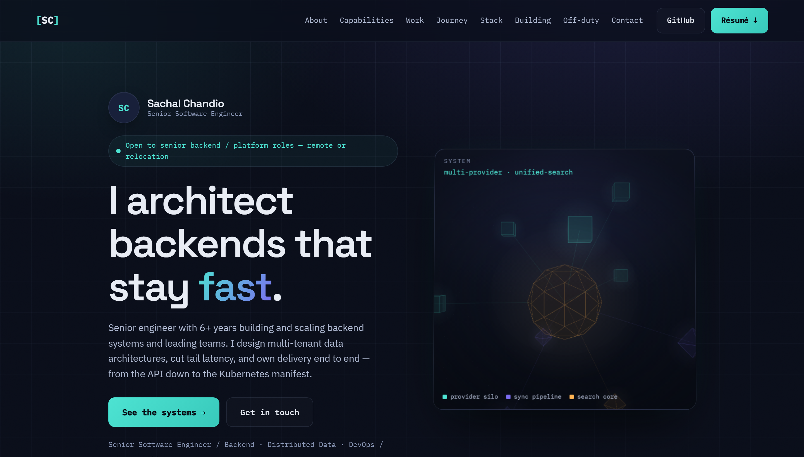
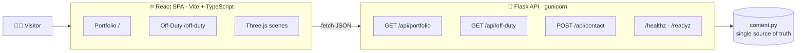
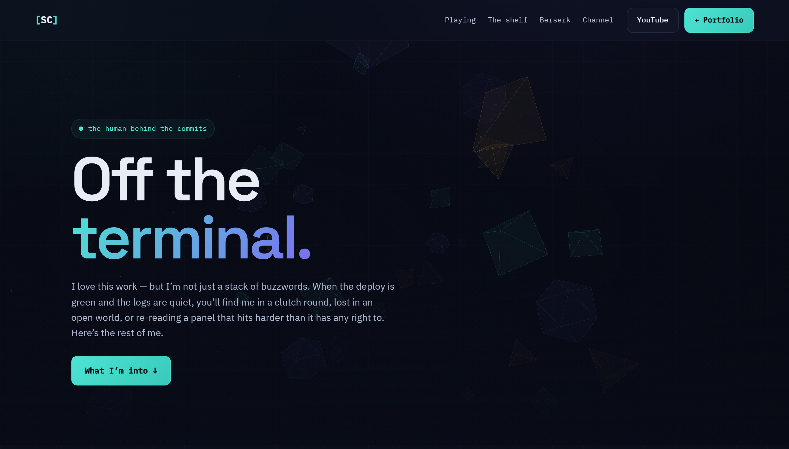

<div align="center">

# `[ SC ]` &nbsp;Sachal Chandio — Portfolio

### Backends that stay **fast**, **consistent**, **observable**, and **hard to break**.

A two-tier portfolio — a **Flask** JSON API and a **React + TypeScript** SPA — with two
interactive **Three.js** scenes, served as one container or two. Design, tests, and CI included.

<br/>

[](https://github.com/sachalchandio/Sachal-Resume/actions/workflows/ci.yml)
&nbsp;


<br/>


<br/>

**[ Live demo — _add your deploy URL here_ ]** &nbsp;·&nbsp; [GitHub](https://github.com/sachalchandio) &nbsp;·&nbsp; [LinkedIn](https://www.linkedin.com/in/sachal-chandio-749b7528/)

<br/>



</div>

---

## ✨ Highlights

- **Two-tier architecture** — a Flask JSON API the React SPA consumes; ships as one image *or* nginx + Flask.
- **Live 3D, two ways** — an orbitable [architecture model](frontend/src/three/ArchitectureScene.tsx) on the hero and a drifting [crystal field](frontend/src/three/CrystalScene.tsx) on the off-duty page, both as React components.
- **Data-driven** — every word lives in [`backend/content.py`](backend/content.py) and is served as JSON. Edit the data, not the markup.
- **Real ops** — non-root Docker image, `/healthz` + `/readyz` probes, and Kubernetes manifests that actually use them.
- **Tested & gated** — `pytest` + `Vitest` suites and a GitHub Actions pipeline that won't ship a red build.
- **Accessible & responsive** — keyboard focus, `prefers-reduced-motion`, and a clean collapse to mobile.

---

## 🏗 Architecture



> **Two deployment shapes from one codebase:** a single image where Flask serves the built SPA **and** the API on one origin ([`Dockerfile`](Dockerfile)) — ideal for a free host — or a two-service split with nginx serving the React build and proxying to Flask ([`docker-compose.yml`](docker-compose.yml)).

---

## 🧰 Tech stack

| Layer        | Tools |
|--------------|-------|
| **Frontend** | React 18 · TypeScript · Vite · React Router · Three.js · vanilla CSS (custom properties) |
| **Backend**  | Flask 3 · gunicorn · flask-cors |
| **Testing**  | pytest · Vitest · Testing Library |
| **Ops**      | Docker · nginx · Kubernetes · GitHub Actions |

#### 🎨 Design — _"Deep Infrastructure"_

A control-room palette for a backend engineer — telemetry cyan, depth violet, a sparing amber, on midnight.


Type: **Space Grotesk** (display) · **IBM Plex Sans** (body) · **IBM Plex Mono** (telemetry).

---

## 📂 Project structure

```
Sachal-Resume/
├── backend/                  # Flask JSON API
│   ├── app.py                #   routes + SPA serving
│   ├── content.py            #   all content (single source of truth)
│   ├── tests/                #   pytest suite
│   └── Dockerfile            #   API-only image (two-tier setup)
├── frontend/                 # React + TypeScript SPA (Vite)
│   ├── src/
│   │   ├── pages/            #   Portfolio · OffDuty · NotFound
│   │   ├── components/       #   Nav, Reveal, Counter, ContactForm, …
│   │   ├── three/            #   ArchitectureScene · CrystalScene
│   │   └── api.ts            #   typed API client
│   ├── nginx.conf            #   serves SPA + proxies /api (two-tier)
│   └── Dockerfile            #   web image (two-tier setup)
├── k8s/                      # Kubernetes manifests (backend + frontend)
├── Dockerfile                # single-image build (SPA + API, one origin)
├── docker-compose.yml        # two-tier local stack
└── .github/workflows/ci.yml  # tests + build pipeline
```

---

## 🚀 Quickstart

<details open>
<summary><b>Local dev</b> — two terminals</summary>

```bash
# 1 · API  →  http://localhost:5000
cd backend && pip install -r requirements.txt && python app.py

# 2 · Web  →  http://localhost:5173   (Vite proxies /api to the backend)
cd frontend && npm install && npm run dev
```
</details>

<details>
<summary><b>One container</b> — Flask serves the SPA + API</summary>

```bash
docker build -t sachal-portfolio .
docker run -p 8000:8000 sachal-portfolio
# → http://localhost:8000
```
</details>

<details>
<summary><b>Two-tier stack</b> — nginx + Flask</summary>

```bash
docker compose up --build
# → http://localhost:8080
```
</details>

---

## 🧪 Tests & CI

```bash
cd backend  && pip install -r requirements-dev.txt && pytest -q   # 8 passing
cd frontend && npm test                                          # 7 passing
```

[`.github/workflows/ci.yml`](.github/workflows/ci.yml) runs on every push & PR:
**backend `pytest`** → **frontend `typecheck → test → build`** → **build both Docker images**.

---

## ☁️ Deploy

The single-image [`Dockerfile`](Dockerfile) deploys as-is to any Docker host
(Render, Railway, Fly.io, Hugging Face Spaces). One service, one URL serving the
site and `/api/*`.

| Setting | Value |
|---|---|
| Runtime | Docker |
| Dockerfile | `./Dockerfile` |
| Build context | repo root |
| Health check | `/healthz` |
| Port | `$PORT` (auto) |

---

## 🔌 API

| Route            | Method | Purpose                              |
|------------------|--------|--------------------------------------|
| `/api/portfolio` | `GET`  | All data for the main page           |
| `/api/off-duty`  | `GET`  | Games, anime, the lines I keep around |
| `/api/contact`   | `POST` | Validate + log a contact message     |
| `/api/metrics`   | `GET`  | Headline metrics feed                |
| `/resume`        | `GET`  | Download the PDF résumé              |
| `/healthz`       | `GET`  | Liveness                             |
| `/readyz`        | `GET`  | Readiness                            |

---

## 🎮 The off-duty page

There's a human behind the commits — a whole second page with an animated anime
shelf (five quotes each), a Berserk wall, and the games on rotation.

<div align="center">

</div>

---

<div align="center">

**Sachal Chandio** — Senior Software Engineer · Backend · Distributed Data · DevOps

[sachalchandio@gmail.com](mailto:sachalchandio@gmail.com) &nbsp;·&nbsp; [GitHub](https://github.com/sachalchandio) &nbsp;·&nbsp; [LinkedIn](https://www.linkedin.com/in/sachal-chandio-749b7528/) &nbsp;·&nbsp; [YouTube](https://www.youtube.com/c/sachalchandio)

<sub>Built with Flask · React · Three.js · Docker · Kubernetes</sub>

</div>
